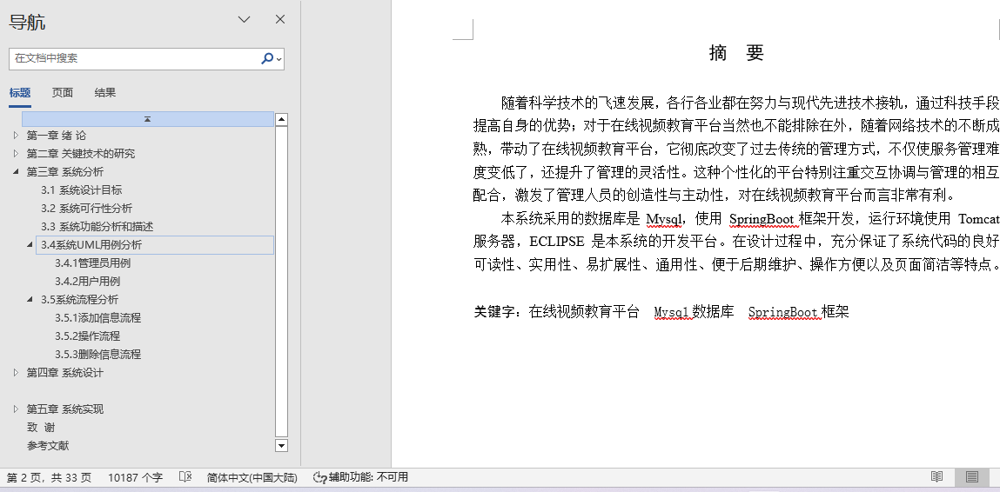
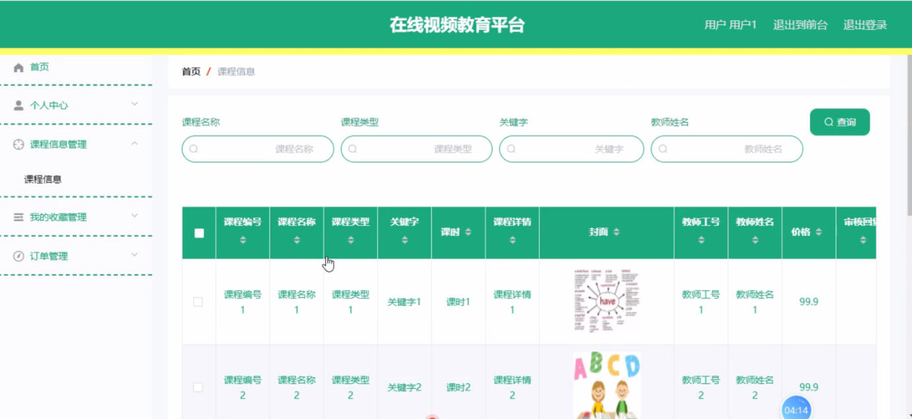
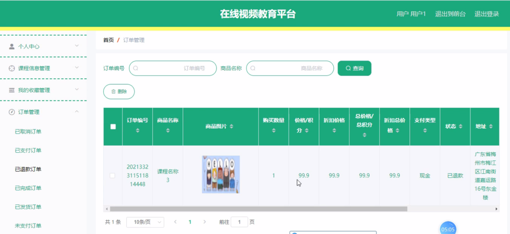
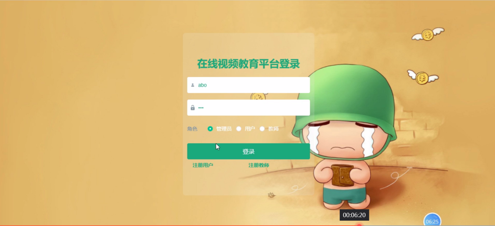
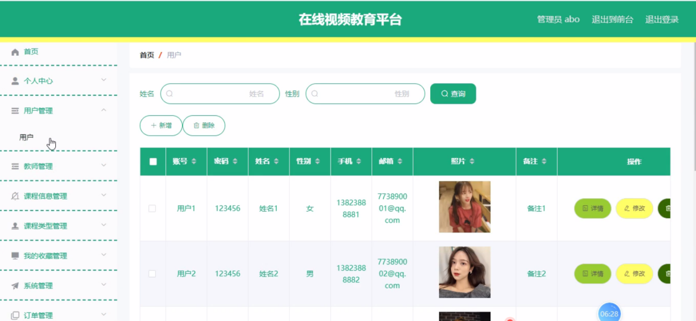
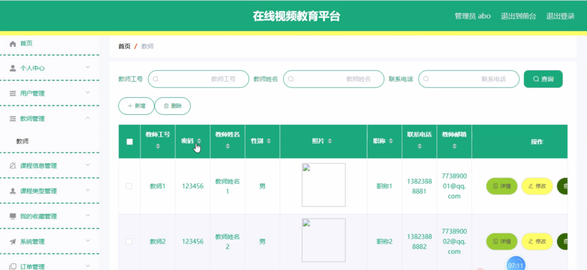
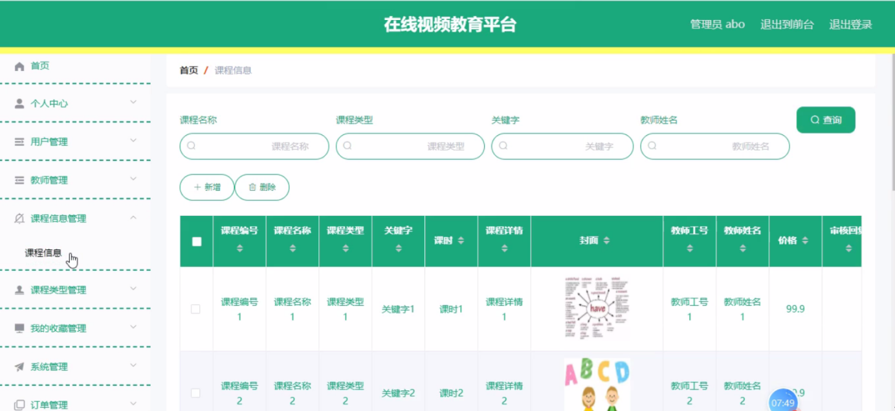
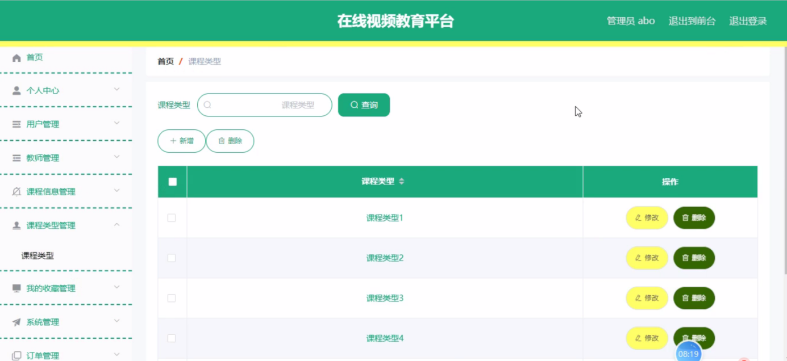
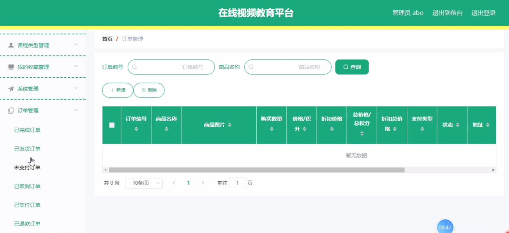
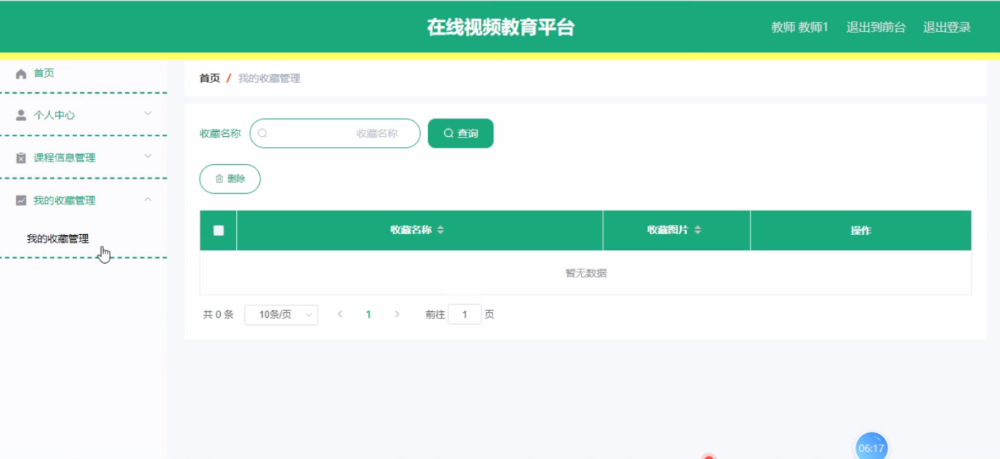

## 基于SpringBoot的在线视频教育平台(程序+报告)

###  获取sql数据库文件: 从戎源码网 (https://armycodes.com/) QQ: 386869957 QQ群: 377586148
###  所有系统地址: (https://github.com/YuLin-Coder/AllProjectCatalog) 
###  所有项目以及源代码本人均调试运行无问题 可支持远程安装部署调试、定制修改、代码讲解

## 项目介绍
基于SpringBoot的在线视频教育平台，系统包含两种角色：用户、管理员，系统分为前台和后台两大模块，主要功能如下：

1 用户功能模块
用户登录系统后可以访问以下功能模块：

个人信息：修改账号、密码、姓名、性别、手机、邮箱、照片、备注等信息。
课程信息管理：查看课程编号、名称、类型、关键字、课时、详情、封面、教师工号、姓名、价格、审核回复、审核状态等信息。
我的收藏管理：查看和管理收藏的课程，进行详情查看、修改及删除操作。
订单管理：查看和管理订单编号、商品名称、商品图片、购买数量、价格/积分、折扣价格、总价格/总积分、支付类型、状态、地址等信息。

2 管理员功能模块
管理员登录系统后可以访问以下功能模块：

用户管理：查看和管理用户账号、密码、姓名、性别、手机、邮箱、照片、备注等信息。
教师管理：查看和管理教师工号、姓名、性别、照片、职称、联系电话、邮箱等信息。
课程信息管理：管理课程编号、名称、类型、关键字、课时、详情、封面、教师信息、价格、审核回复、审核状态等信息。
课程类型管理：管理课程类型信息。
我的收藏管理：管理收藏的课程。
轮播图管理：管理首页轮播图，包括新增、修改、删除操作。
订单管理：管理订单编号、商品名称、商品图片、购买数量、价格/积分、折扣价格、总价格/总积分、支付类型、状态、地址等信息。

3 教师功能模块
教师登录系统后可以访问以下功能模块：

课程信息管理：查看和管理课程编号、名称、类型、关键字、课时、详情、封面、教师信息、价格、审核回复、审核状态等信息。
我的收藏管理：查看和管理收藏的课程，进行详情查看、修改及删除操作。

4 前台首页功能模块
用户登录系统后可以访问前台首页，查看以下内容：

首页：显示系统的主要信息和功能入口。
课程信息：查看课程编号、名称、类型、关键字、课时、详情、教师信息、点击次数等信息，并进行购物车操作或收藏操作。
购物车：查看购物车中的商品信息，进行购买或删除操作。
个人中心：访问个人信息和管理功能。
后台管理：访问系统管理功能。

## 项目技术
- 编程语言：Java
- 数据库：MySQL
- 项目管理工具：Maven
- 前端技术：HTML、CSS、JavaScript、Jquery、Vue
- 后端技术：Spring、SpringMVC、MyBatis

## 运行环境
- JDK版本：JDK1.8及以上
- 开发工具：IDEA、Ecplise、Myecplise都可以
- 数据库: MySQL5.7及以上
- Maven：maven3.0及以上
- Node：14.14.0及以上

## 运行截图

